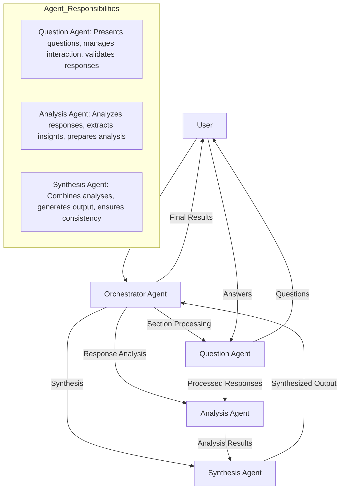

# Relaxing Form Filler

A tool for interactive questionnaire processing using Azure AI agents.

## Overview

This tool processes structured questionnaires in markdown format, facilitating interactive conversations through Azure AI agents. It guides users through each section of a questionnaire, analyzes responses, and synthesizes answers based on the conversation.

Key features:
- Section-by-section processing with progress tracking
- Continuation from previously unfinished work
- Real-time temporary results file for monitoring progress
- Final output saved in markdown format
- Uses Azure AI Projects SDK for agent management

## Multi-Agent Architecture

The system employs a sophisticated multi-agent architecture where different agents work together to process the questionnaire efficiently. Here's how the agents interact [link](https://mermaid.live/edit#pako:eNptUsmO2zAM_RVBZ2fgJasOBTxJCvQ0XS-1g4Fis47QWHIluZ1s_17KsjPJtD4IIvXe4yPpEy1UCZTRSvNmR76ucknwS7NvBvSGjEbvzh9k09ozecyedLEDYzW3SpO0Amk3Hv3Y4b5AYYWS5KNWBRgjZHUmy-xTixSX_pfwGUyjpAGSSr4_GGHOZJUN9_8VOEiLBhxunV2DO6A_lx18qIzwtO-qy6fS_AGN2eUtuncNJRlsOTsesep5vTMEtHvrXPjn9Z27I0o8tdbP7Nb-e4ECr-T01rFpt34BXTPPvQWxFXthBRgP6sw-l2CKN1NlOHMweDHk19B0QGoueQWGCGlB8243AfnN96LkFtN6aHPzqr7y6vc7YH4_x1tOQODFOlEnb0S1s5hqNDQcIYT3_BvltVd-szVGlqreCnnlOGV8QL_OourGiLWkaZ1u4WZiLMji0EuDLGmA_64oKbO6hYDWoGvuQnpykJxivRpyyvBacv0zp7m8IKfh8rtS9UDTqq12lP3ge4NR27gZrQTHpdTXrMZqoJeqlZayOAk7EcpO9IWyURQ-LJJpNJ8msyhehPPJIqAHyqLx7CGMw_k0SsI4GS-iySWgx65whA9xOIkns_k0nCbheHz5C7AlLC0)



The system uses three specialized agents working in concert:

1. **Question Agent**: Manages the interactive Q&A process, presenting questions and collecting responses
2. **Analysis Agent**: Processes and analyzes user responses to extract key insights
3. **Synthesis Agent**: Combines analyses and generates the final output

The Orchestrator Agent coordinates these specialized agents, ensuring smooth workflow and maintaining context throughout the questionnaire process.

## Installation

1. Clone this repository:
```bash
git clone https://github.com/johnmaeda/py-relaxing-form-filler.git
cd py-relaxing-form-filler
python -m venv venv
source venv/bin/activate
```

2. Install dependencies:
```bash
pip install azure-ai-projects azure-identity rich
```

## Usage

### Deploy Two Models Please

Make sure you deploy `gpt-4o` and `gpt-4o-mini` with the exact naming of those models as-is. If the deployment name is any different, then please be sure to modify the code accordingly.

### Custom Connection String

By default, the tool uses the "Azure AI Foundry Project Connection String" which you can find from Overview > Project details > Project connection string

```bash
export AZURE_AI_CONN_STR="connection string here"
```

### Requires Login To Azure

Be sure to be logged in to Azure:

```bash
az login
```

### Basic Usage

Run the processor with a markdown file containing a questionnaire. There are a few samples available:

- qa_sample_food.md: Getting to understand your foodie-ness
- qa_sample_whoamid.md: Basic overview of who you are
- qa_sample_msconnect.md: Corporate performance review sample
- qa_sample_shrm_generic.md: Corporate performance review sample

```bash
python azure_ai_form.py qa_sample_food.md
```

### Command Line Options

The tool supports several command-line options:

```bash
python azure_ai_form.py questions.md [--unfinished UNFINISHED] [--max-turns MAX_TURNS] [--completion-threshold THRESHOLD]
```

Options:
- `--unfinished`, `-u`: Path to unfinished Q&A file (optional)
- `--max-turns`, `-t`: Maximum number of conversation turns per section (default: 5)
- `--completion-threshold`, `-c`: Completion threshold percentage (0-100) to consider a section complete (default: 90)

Examples:
```bash
# Basic usage with default settings
python azure_ai_form.py questions.md

# Specify maximum turns and completion threshold
python azure_ai_form.py questions.md --max-turns 10 --completion-threshold 80

# Continue from a previous file
python azure_ai_form.py questions.md -u previous_results.md
```

### Continue from Unfinished Work

> Note that the system will try to make sure it doesn't use too many tokens, and will stop after a maximum number of turns. When it does so, it will write out an intermediate file that you can use to continue the session.

If you have an unfinished questionnaire session, you can continue from there:

```bash
python azure_ai_form.py sample_sample.md previous_results.md
```

the `previous_results.md` file refers to the file that was written prematurely by the system.

## Questionnaire Format

Create your questionnaire in markdown format with this structure:

```markdown
### Section Title

1. First question in this section?
2. Second question in this section?
3. Third question in this section?

### Another Section

1. First question in second section?
2. Second question in second section?
```

## Interactive Commands

During the questionnaire session, you can:
- Type `exit` or `quit` (or `x`/`q`) to end the session and save partial results
- Otherwise, just respond normally to the questions

## Monitoring Progress

While the tool runs, it maintains a temporary file (`temp_results.md`) that updates after each section is completed. This allows you to:
- Monitor progress in real-time
- See which section is currently being processed
- View synthesized answers as they're generated

The temporary file is automatically deleted when the process completes successfully.

## Output

The final results are saved to a markdown file with a timestamp (e.g., `qa_result_20240520_123045.md`).

## Example

Here's a typical workflow:

1. Create a markdown file with your questionnaire sections and questions
2. Run the processor: `python azure_ai_form.py your_questions.md`
3. The tool will prompt you to select a model
4. Follow the conversational prompts for each section
5. Monitor progress in the temporary file (`temp_results.md`)
6. When complete, results are saved to the final output file

